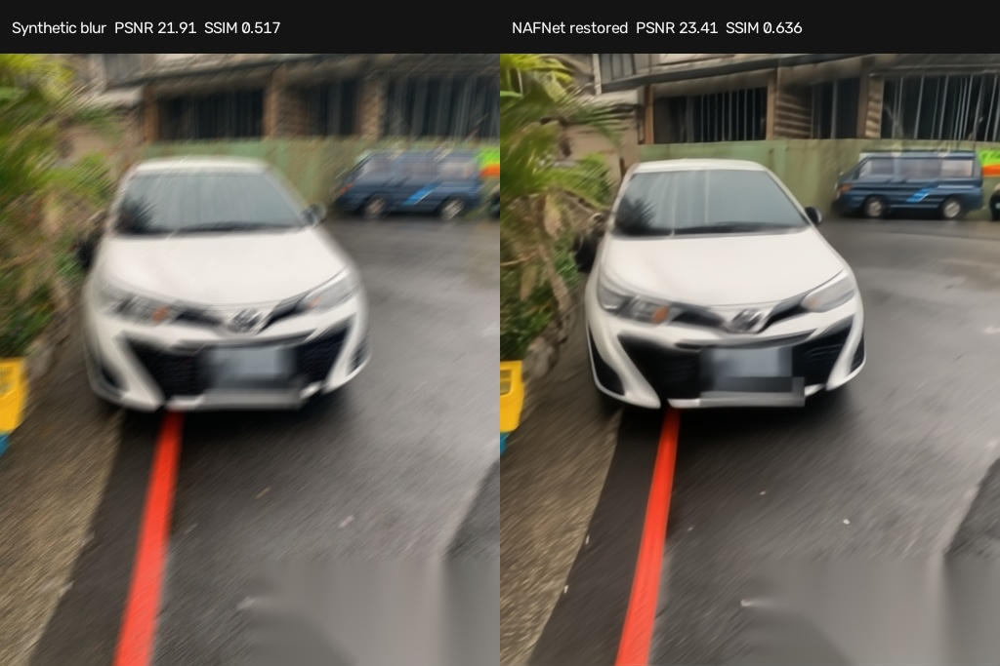
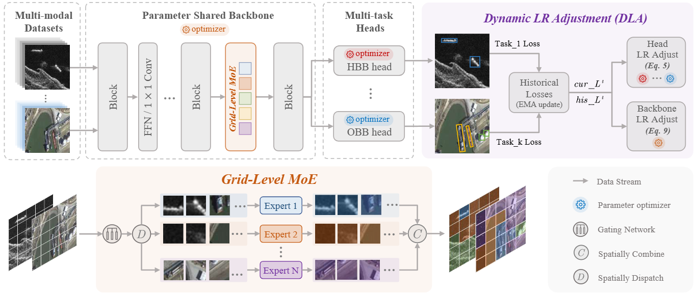

# solveillegalparkingbyVLM
## 基於多模態時序感知與邊緣運算之道路交通事件偵測與風險評估系統

### 研究動機

原始專案以紅線違停辨識為主，但實際道路監控還需要處理連續影像、事故
事件、跨攝影機場景差異、誤報成本與有限的邊緣運算資源。因此本研究將
單一違規辨識擴展為可訓練、可驗證並可模擬部署的交通事件分析系統。

### 研究方法

- 以 YOLO、RT-DETR、ByteTrack 與 motion proposal 建立線上候選區域。
- 以 causal TCN、VideoMAE 與候選特徵融合進行時間序列事件辨識。
- 以 SAM2 與 VLM 產生可追溯的視覺證據與事件摘要。
- 結合台灣政府開放資料分析違規熱區、A1/A2 風險與部署優先順序。
- 以 Python、Verilog 與 SystemC 模擬多攝影機、NPU 佇列、延遲與丟幀。

### 系統功能

- 紅線違停、道路事故與異常交通事件偵測。
- 支援圖片、影片、Webcam、串流網址與公開 CCTV 輸入。
- 車牌與畫面文字隱私處理，以及 before/trigger/after 時序證據輸出。
- IID/geographic OOD、事件召回率、觸發延遲與 false alerts/hour 評估。
- 邊緣裝置容量估算、候選事件分流與 Verilog/SystemC 硬體模擬。

### 原始專案背景

本專案源自 2025 高通台灣 AI 黑客松。原始版本使用 YOLO 做車輛檢測，
經 NAFNet 影像復原後交由 VLM 判斷是否違規，並以 SM3Det 評估難以辨識的
多來源監視器畫面。紅線違停現保留為第一個完整事件案例。

### 困難監視器畫面處理實驗

使用官方 `NAFNet-REDS-width64` 權重，在先移除車牌與右下角日期地址的圖片
上加入固定 motion blur，再執行真實 GPU restoration。PSNR 由 `21.91dB`
提升至 `23.41dB`，SSIM 由 `0.517` 提升至 `0.636`；RTX 3060 單張延遲
為 `2.45s`。這是困難畫面復原實驗，不是事故辨識準確率。

SM3Det 官方 release、config 與論文結果也已完成可重現檢查：RGB/SAR/IR
三來源、8 experts、top-k 3、487G FLOPs、178M parameters。其官方成績來自
遙測目標偵測而非道路 CCTV，因此本專案將它定位為雲端 hard-frame 或未來
多感測器研究分支，不放進即時 edge 主路徑。稽核結果見
[sm3det_transfer_audit.json](docs/assets/sm3det_transfer_audit.json)。

SM3Det 架構圖取自[官方 repository](https://github.com/zcablii/SM3Det)，依其
CC BY-NC 4.0 授權標示；圖中展示的是遙測多模態方法，不是本專案的 CCTV
推論輸出。

---
### 團隊成員資訊

蔡霆鋒 janalexei88@gmail.com

辛語柔 yujouhsin@gmail.com

周佳欣 jassinchouxd@gmail.com

---
### 專案介紹

1. 攝影機及其輔助裝置優先採取邊緣運算的裝置設備，例如：ESP32, raspberry pi 等性能較低之設備

2. 架構上採混合雲，透過ESP32-CAM收集到的畫面，傳到雲端，經系統處理後，產生摘要，最後交由USER確定是否開立罰單

---
### Demo

---
### 基於多模態時序感知與邊緣運算之道路交通事件偵測與風險評估系統

點擊預覽可播放 MP4。片段取自
[ACCIDENT 交通監視器事故資料集](https://github.com/accidentbench/ACCIDENT)，用於測試事件時間、位置與事故類型辨識；此衍生片段依原資料集的
[CC BY-NC-SA 4.0](https://creativecommons.org/licenses/by-nc-sa/4.0/) 條款提供。

---
### 模型實際輸出

這不是示意框。影片由 YOLO/ByteTrack、motion candidate ROI 與校準後的
causal TCN 實際推論產生，推論時未讀取 ACCIDENT 的事故標註框。連續兩個
高分視窗才建立審核事件，車輛下半部則做隱私模糊。點擊預覽可播放 MP4。

以視窗結束時間計算，這支 Demo 在事故後 `0.792s` 完成觸發。這是單片
整合測試，不代表完整資料集的事件召回率或延遲分布。

---
### 線上事故候選區域

系統已能在不讀取事故標註框的情況下，以 YOLO/ByteTrack、畫面 motion 與可選的 SAM2 box prompt 產生候選區域。500 支 ACCIDENT 影片共產生 822 個視窗，零處理失敗。

| 500-clip 模型 | IID F1 | Geographic F1 |
| --- | ---: | ---: |
| Global motion logistic | 0.405 | 0.516 |
| Online candidate ROI logistic | 0.581 | 0.615 |
| Global causal TCN | 0.642 | 0.569 |
| Online candidate ROI TCN | 0.629 | 0.668 |
| Frozen VideoMAE-small + linear head | 0.646 | 0.610 |
| Candidate ROI + frozen VideoMAE | 0.634 | 0.615 |

完整指標、FPR 與研究限制請見 [ACCIDENT Phase 1 results](docs/accident_phase1_results.md)。

### 正式事件與模型結果

100 支 IID test 事故影片的 responsive profile event recall 為 `0.750`，
trigger delay median `0.394s`、p95 `2.251s`；連續兩窗的 conservative
profile recall 為 `0.440`。完整 type breakdown 與離題警報數見
[正式實驗與部署整合報告](docs/final_evaluation_report.md)。

VideoMAE 已完成最後一個 encoder block 的部分微調。以相同 500 clips、
相同 split 與 train-holdout FPR 校準比較，edge TCN 的 IID/geographic F1
為 `0.473/0.499`，frozen VideoMAE 為 `0.447/0.358`，部分微調 VideoMAE
為 `0.260/0.382`。微調版 fixed-threshold IID F1 雖達 `0.746`，FPR 也高達
`0.860`，因此不採用該 operating point。

### SAM2、VLM 與 Edge 驗證

- SAM2.1-t 在共同 10 clips 將 proposal recall@0.1 由 `0.667` 提升至
  `0.680`，recall@0.3 不變，耗時為基線的 3.43 倍。
- Qwen2.5-VL-3B 可輸出合法 review JSON，但 clean blind test 漏掉遠距碰撞；
  VLM 用於事件摘要、證據缺口與人工排序，不取代 TCN。
- 政府正常 CCTV 累積 `0.0867 camera-hours`，連續兩窗 gate 為 0 alerts，
  但零事件 95% 上限仍為 `34.55 alerts/hour`。
- Verilog 三個 testbench 全數通過；SystemC 3.0.2 與 Python 對 49,320 個
  processed frames、6,808 candidates、2,156 reviews 完成 trace parity。
- TCN ONNX 128 samples 最大誤差 `1.79e-7`；QNN/QAI Hub compile command
  已產生，實體 Snapdragon latency 需有 QAI Hub credential 後量測。
- 113 年 A1/A2 與新北公開攝影機空間整合顯示，既有 17 點對新北 top-risk
  grids 的 1km 風險加權覆蓋率為 `18.95%`。

---
### 安裝說明

1. 建立虛擬環境
   
`python -m venv venv`

2. 啟動虛擬環境

PowerShell:

`.\venv\Scripts\Activate.ps1`

cmd:

`.\venv\Scripts\activate.bat`

3. 安裝需要的套件

`pip install -r Application\DebugVersion\requirements.txt`

---
### 執行與使用說明

1. 開啟終端機

2. 進入程式資料夾

`cd Application/DebugVersion/src`

3. 執行程式檔

`python main.py`

4. 在 GUI 中上傳照片

5. 開始分析
