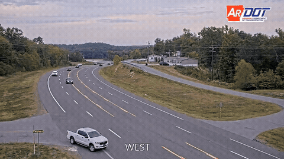
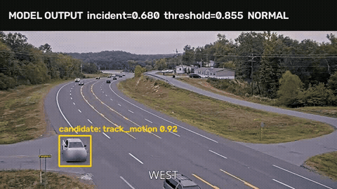

# TrafficGuard Edge
## 邊緣智慧交通事件偵測與風險治理平台

### 改版動機

原始專案以紅線違停辨識為主，但政府實際部署還需要處理連續影像、事故
事件、跨攝影機場景差異、誤報成本與有限的邊緣運算資源。因此新版將
單一違規辨識擴展成可訓練、可驗證、可模擬部署的交通事件平台。

### 方法

- 以 YOLO、RT-DETR、ByteTrack 與 motion proposal 找出線上候選區域。
- 以 causal TCN、VideoMAE 與候選特徵融合判斷時間序列事件。
- 以 SAM2 與 VLM 產生可追溯的視覺證據與事件摘要。
- 以台灣政府開放資料分析違規熱區、A1/A2 風險與部署優先順序。
- 以 Python、Verilog 與 SystemC 模擬多攝影機、NPU 佇列、延遲與丟幀。

### 主要功能

- 紅線違停、道路事故與異常交通事件偵測。
- 圖片、影片、Webcam、串流網址與公開 CCTV 輸入。
- 車牌與畫面文字隱私處理、before/trigger/after 證據包及 VLM 複核介面。
- IID/geographic OOD、事件召回率、觸發延遲與 false alerts/hour 評估。
- 邊緣裝置容量估算、候選事件分流及 Verilog/SystemC 硬體模擬。

### 原始專案背景

本專案源自 2025 高通台灣 AI 黑客松。原始版本使用 YOLO 做車輛檢測，
經 NAFNet 模糊處理後交由 VLM 判斷是否違規，並規劃以 SM3Det 處理難以
辨識的監視器畫面。紅線違停現保留為第一個完整事件案例。

---
### 團隊成員資訊

蔡霆鋒 janalexei88@gmail.com

辛語柔 yujouhsin@gmail.com

周佳欣 jassinchouxd@gmail.com

---
### 專案介紹

1. 攝影機及其輔助裝置優先採取邊緣運算的裝置設備，例如：ESP32, raspberry pi 等性能較低之設備

2. 架構上採混合雲，透過ESP32-CAM收集到的畫面，傳到雲端，經系統處理後，產生摘要，最後交由USER確定是否開立罰單

---
### Demo

---
### TrafficGuard Edge：邊緣智慧交通事件偵測與風險治理平台

點擊預覽可播放 MP4。片段取自
[ACCIDENT 交通監視器事故資料集](https://github.com/accidentbench/ACCIDENT)，用於測試事件時間、位置與事故類型辨識；此衍生片段依原資料集的
[CC BY-NC-SA 4.0](https://creativecommons.org/licenses/by-nc-sa/4.0/) 條款提供。

---
### 模型實際輸出

這不是示意框。影片由 YOLO/ByteTrack、motion candidate ROI 與校準後的
causal TCN 實際推論產生，推論時未讀取 ACCIDENT 的事故標註框。連續兩個
高分視窗才建立審核事件，車輛下半部則做隱私模糊。點擊預覽可播放 MP4。

以視窗結束時間計算，這支 Demo 在事故後 `0.792s` 完成觸發。這是單片
整合測試，不代表完整資料集的事件召回率或延遲分布。

---
### 線上事故候選區域

系統已能在不讀取事故標註框的情況下，以 YOLO/ByteTrack、畫面 motion 與可選的 SAM2 box prompt 產生候選區域。500 支 ACCIDENT 影片共產生 822 個視窗，零處理失敗。

| 500-clip 模型 | IID F1 | Geographic F1 |
| --- | ---: | ---: |
| Global motion logistic | 0.405 | 0.516 |
| Online candidate ROI logistic | 0.581 | 0.615 |
| Global causal TCN | 0.642 | 0.569 |
| Online candidate ROI TCN | 0.629 | 0.668 |
| Frozen VideoMAE-small + linear head | 0.646 | 0.610 |
| Candidate ROI + frozen VideoMAE | 0.634 | 0.615 |

完整指標、FPR 與研究限制請見 [ACCIDENT Phase 1 results](docs/accident_phase1_results.md)。

以 train-only holdout 將 TCN 門檻校準到 20% window FPR 後，IID 測試 FPR
由 0.531 降至 0.235，F1 由 0.629 降至 0.473。這是政府場域降低誤報時
必須揭露的 recall 取捨，不使用 test split 調整門檻。

Frozen VideoMAE 使用 16 幀、384 維 embedding，在 RTX 3060 上完成 822 個
視窗抽取，零失敗，速度 1.46 windows/s。它在固定門檻的 IID F1 略高於
candidate TCN，但 geographic F1 較低；目前是 frozen encoder 比較，不宣稱
已完成 VideoMAE 微調。事故候選也可輸出 before/trigger/after 三幀隱私化
證據包交給 VLM。

---
### 安裝說明

1. 建立虛擬環境
   
`python -m venv venv`

2. 啟動虛擬環境

PowerShell:

`.\venv\Scripts\Activate.ps1`

cmd:

`.\venv\Scripts\activate.bat`

3. 安裝需要的套件

`pip install -r Application\DebugVersion\requirements.txt`

---
### 執行與使用說明

1. 開啟終端機

2. 進入程式資料夾

`cd Application/DebugVersion/src`

3. 執行程式檔

`python main.py`

4. 在 GUI 中上傳照片

5. 開始分析
