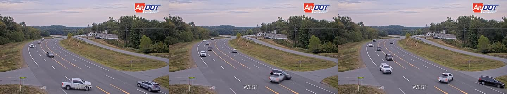

# 正式實驗與部署整合報告

## 1. 實驗範圍

本輪完成 ACCIDENT 事故事件批次評估、VideoMAE 部分微調、TCN/VideoMAE/
SAM2/VLM 分層比較、正常政府 CCTV 試驗、Verilog/SystemC 驗證、ONNX/QNN
部署前檢查，以及政府事故、違規與攝影機地點的空間整合。紅線違停保留為
第一個完整規則事件案例，事故偵測則是目前的公開資料訓練主線。

## 2. 事故事件召回與延遲

正式批次使用 ACCIDENT IID test split 的 100 支影片，每種碰撞類型各 20 支。
推論階段只使用 YOLO/ByteTrack、motion candidate ROI 與 causal TCN；事故時間
標註只在推論後計算事件召回與 trigger delay。

| Profile | 連續正窗 | Event recall | Delay mean | Delay median | Delay p95 | Early / late episodes |
| --- | ---: | ---: | ---: | ---: | ---: | ---: |
| Responsive | 1 | 0.750 | 0.546s | 0.394s | 2.251s | 90 / 238 |
| Conservative | 2 | 0.440 | 0.689s | 0.608s | 2.674s | 24 / 68 |

Responsive profile 對 rear-end recall 為 0.95，head-on 為 0.60；其高召回伴隨
大量事故時間窗外的 alert episodes。Conservative profile 可降低離題警報，但
也漏掉 31 支原本可偵測的事故。因此目前適合做安全事件分流，不適合直接
自動執法。完整表格位於 [accident_event_metrics.csv](results/accident_event_metrics.csv)。

## 3. TCN 與 VideoMAE 公平比較

三種模型使用相同 500 clips、相同 temporal windows、IID/geographic split，
且 test split 不參與 threshold 選擇。固定 0.5 threshold 便於觀察原始分數，
主要部署比較則使用 grouped train holdout 校準到 20% window FPR。

| 模型 | IID F1 / FPR | Geographic F1 / FPR |
| --- | ---: | ---: |
| Candidate ROI TCN | 0.473 / 0.235 | **0.499 / 0.304** |
| Frozen VideoMAE + linear head | **0.447 / 0.196** | 0.358 / 0.217 |
| Partial fine-tuned VideoMAE | 0.260 / **0.095** | 0.382 / **0.217** |

VideoMAE 解凍最後一個 encoder block，使用 encoder `1e-5`、head `1e-3`、
class-weighted loss 與 train-holdout early stopping。IID 在 epoch 3、geographic
在 epoch 10 取得最佳 holdout loss。雖然 fixed 0.5 的 IID F1 為 0.746，但
FPR 高達 0.860，不能當成部署優勢；在公平 FPR 約束下微調版低於 frozen
encoder，顯示 500 clips 不足以穩定 fine-tune。現階段選 TCN 為 edge trigger，
frozen VideoMAE 為較重的交叉驗證器。完整數字位於
[model_fair_comparison.csv](results/model_fair_comparison.csv)。

## 4. SAM2 與 VLM 的實際用途

SAM2 與 VLM 不是和 TCN 相同任務的事故分類器，因此分成 proposal 與 review
兩階段評估。SAM2.1-t 在共同 10 clips 的 recall@0.1 從 0.667 增至 0.680，
recall@0.3 不變為 0.453，耗時由 10.855s 增至 37.213s。它適合保留為困難
候選的 mask evidence，不適合每幀啟用。

Qwen2.5-VL-3B 在有 TCN context 時判為事件並遵守 JSON schema，但理由主要
複述模型分數；移除 overlay 與模型分數的 clean blind test 則漏掉畫面中的
碰撞。0.5B LLaVA/Qwen 有提到碰撞，卻輸出無效 schema 並加入畫面不存在的
紅燈敘述。VLM 的可用角色因此是候選摘要、缺失證據檢查與人工佇列排序，不能
取代時序 detector。原始結果位於 [sam2_vlm_ablation.csv](results/sam2_vlm_ablation.csv)。

## 5. 正常 CCTV 與即時性

臺中市政府公開 CCTV 連續擷取 300.26 秒，得到 252 幀、有效 0.837 FPS，
其中 63.1% 為端點重複畫面。人工 contact-sheet 檢查未見事故。16 個 windows
有 1 個 raw positive，但連續兩窗 gate 後為 0 false-alert episodes。合併前一
session 共 0.0867 camera-hours、21 windows，觀察值為 0 alerts/hour；零事件
Poisson 95% 上限仍為 34.55 alerts/hour。這是 domain-shift pilot，不是足夠的
政府部署誤報率證明。

## 6. Verilog、SystemC 與 QNN

- Icarus Verilog：`dwell_fsm_tb`、`bbox_overlap_counter_tb`、
  `motion_trigger_tb` 全部通過。
- Accellera SystemC 3.0.2：以 12,330 筆真實 candidate trace 複製成 4 路
  camera workload。Python/SystemC 都得到 49,320 processed frames、0 drops、
  6,808 candidates、2,156 completed reviews、4,652 review drops。SystemC 在
  模擬終點多產生 4 個尚未處理的 arrival，屬終點事件記帳差異。
- TCN ONNX：128 samples 的最大絕對誤差 `1.79e-7`，ONNX checker 通過。
- QNN：已產生 `qnn_dlc` / NPU / Samsung Galaxy S23 的 QAI Hub compile
  command；本機沒有 QAI Hub credential，因此不能宣稱已取得 Snapdragon
  latency 或功耗數字。

此壓力情境的 NPU frame queue 沒有掉幀，但 300ms review stage 丟棄 68.33%
候選，證明昂貴 VLM 不應同步處理每個 proposal，必須使用 persistence、去重、
priority queue 或雲端批次覆核。

## 7. 政府資料整合

使用 393,854 筆 113 年 A1/A2、309,493 筆桃園違規紀錄與 17 個新北公開
違停攝影機地點。全國 top-30 事故網格中有 27 個位於新北；既有攝影機在
500m、1km、2km 的風險加權覆蓋率分別為 10.75%、18.95%、24.84%。這個
結果可直接形成「先補哪裡的 edge camera」排序。

桃園違規情境假設高熱點降低 35%，推估 top-30 違規由 19,280 降至 16,560，
月淨節省 149,467 元；A1/A2 情境假設高風險網格可降低 20% detectable
precursors，推估整體 top-30 risk score 降幅 7.21%。兩者都是規劃情境，必須
由部署前後的重複月份資料驗證，不能表述為本系統已造成的因果結果。空間明細
位於 [government_risk_integration.json](assets/government_risk_integration.json)。

## 8. 結論

目前最可辯護的貢獻不是單一模型達到 0.9，而是把候選生成、時序偵測、
VLM evidence review、正常流量誤報、edge queue、硬體模擬與政府風險部署
接成可重現評估鏈。下一個主要缺口是累積獨立正常 CCTV camera-hours、擴大
clean blind VLM validation set，以及取得實體 Snapdragon/QAI Hub profile。
